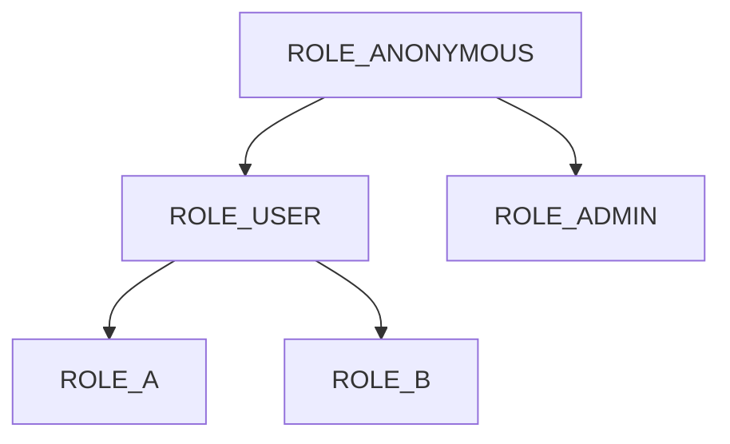
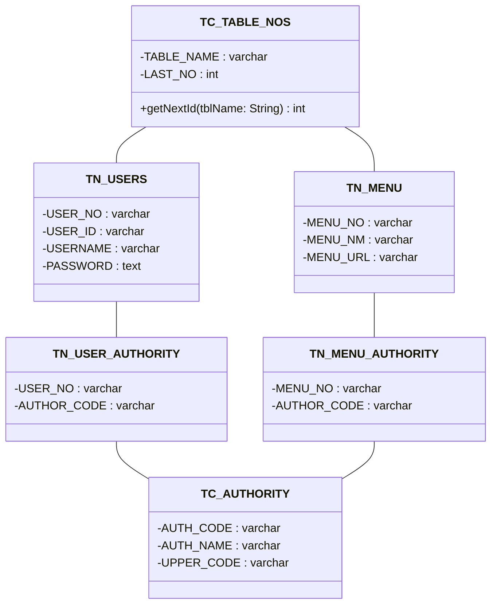

# Study Project

- Spring Security
- JWT Token Authentication
- Webflux

# Roles

- ROLE_ANONYMOUS: 접근 권한 없음.
- ROLE_USER: /api/enc
- ROLE_A: /api/a/**
- ROLE_B: /api/b/**
- ROLE_ADMIN: /**

# Tables

##### Postgresql Query

- [ddls](./scripts/ddl_pgsql.sql)
- [dmls](./scripts/dml_pgsql.sql)

