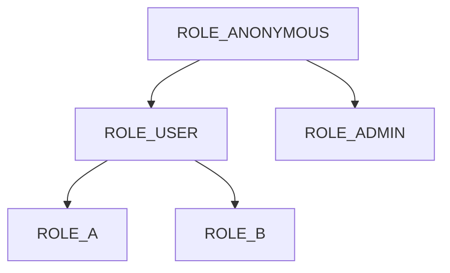

# Study Project

- Spring Security
- JWT Token Authentication
- Webflux

# Roles

- ROLE_ANONYMOUS: 접근 권한 없음.
- ROLE_USER: /api/enc
- ROLE_A: /api/a/**
- ROLE_B: /api/b/**
- ROLE_ADMIN: /**

# Tables

###### [ddls](./scripts/ddl_pgsql.sql)

> ### TC_TABLE_NOS
> PK 저장 테이블
> - TABLE_NAME varchar(50)
> - LAST_NO integer

> ### TN_USERS
> User 저장 테이블
> - USER_NO varchar(20)
> - USER_ID varchar(20)
> - USERNAME varchar(20)
> - PASSWORD text

> ### TC_AUTHORITY
> 권한코드 목록
> - AUTH_CODE varchar(20)
> - AUTH_NAME varchar(20)
> - UPPER_CODE varchar(20)

> ### TN_MENU
> 메뉴 목록
> - MENU_NO varchar(20)
> - MENU_NM varchar(50)
> - MENU_URL varchar(50)

> ### TN_USER_AUTHORITY
> 사용자별 권한 목록
> - USER_NO varchar(20)
> - AUTHOR_CODE varchar(20)

> ### TN_MENU_AUTHORITY
> 메뉴별 권한 목록
> - MENU_NO varchar(20)
> - AUTHOR_CODE varchar(20)

