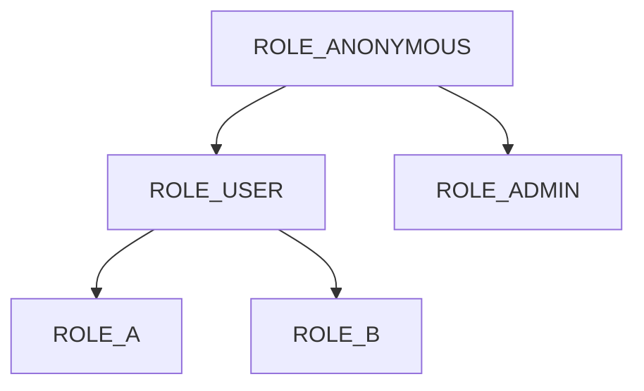
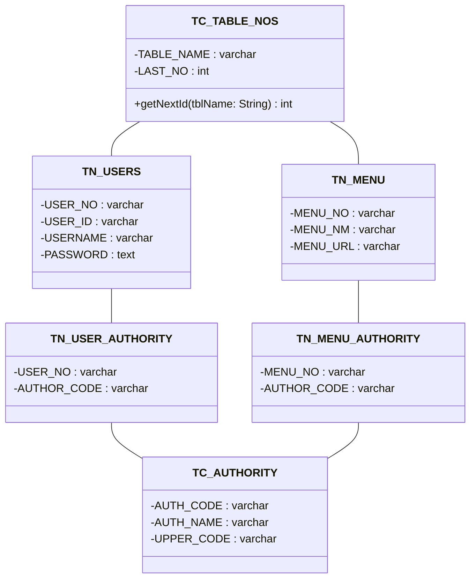

# Study Project

- Spring Security
- JWT Token Authentication
- Webflux

# Roles



- ROLE_ANONYMOUS: 접근 권한 없음.
- ROLE_USER: /api/enc
- ROLE_A: /api/a/**
- ROLE_B: /api/b/**
- ROLE_ADMIN: /**

# Tables

##### Postgresql Query

- [ddls](./scripts/ddl_pgsql.sql)
- [dmls](./scripts/dml_pgsql.sql)



# Error Handling
> Spring Controller에서 Exception이 던져지면 BasicErrorController에서 @RequestMapping("/error) 수신
> 이를 catch하기 위해 컨트롤러를 보조(@ControllerAdvice)하는 ExceptionHandler 빈을 추가하고 interface ErrorController를 구현한
> 새로운 ErrorController를 작성한다.
> ```java
> // Exception Handler일 뿐 /error를 수신하는 컨트롤러는 아래에 있음.
> // @...
> @Component
> @ControllerAdvice // 또는 @RestControllerAdvice
> public class GlobalExceptionHandler {
>     
>     @ExceptionHandler({
>           RuntimeException.class,
>           Exception.class
>     })
>     public void resolveException(Exception ex,
>                                  HttpServletRequest request,
>                                  HttpServletResponse response) { /* ... */ }
> }
> ```
> 
> ```java
> // @RequestMapping("/error") 수신 후 exception 정보를 파싱해서 새 exception을 던져
> // exception handler가 처리할 수 있도록 한다.
> @Controller
> public class CustomErrorController implements ErrorController {
>   @RequestMapping("/error")
>   public void handleError(HttpServletRequest request,
>                           HttpServletResponse response) throws Exception {
>       throw (Exception) request.getAttribute(RequestDispatcher.ERROR_EXCEPTION);
>   }
> 
> }
> ```